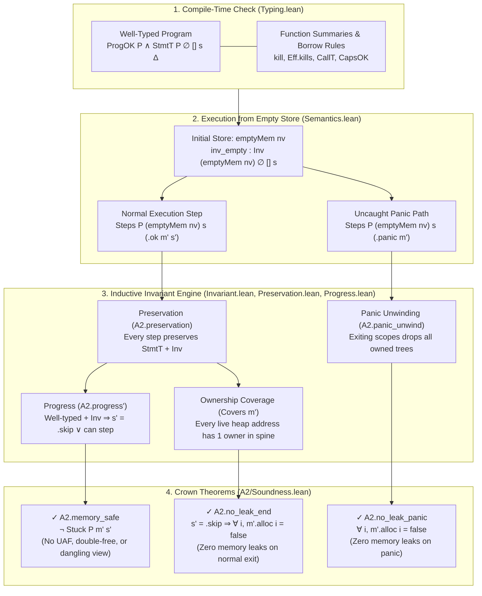
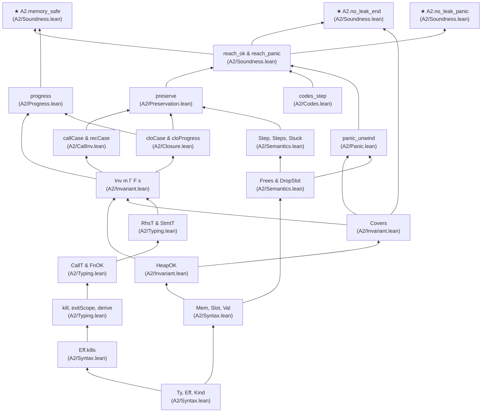

# Visual Blueprint of the Lean 4 Soundness Proof (`formal/`)

> **Interactive Explorer:** You can also explore this proof interactively (with a step-by-step memory & borrow-checker simulator, clickable theorem dependency graph, and searchable soundness-hole corpus) on **[nurl-lang.org/docs/formal-verification](https://nurl-lang.org/docs/formal-verification)**.

* **Toolchain:** `leanprover/lean4:v4.35.0` (zero external dependencies; standard axioms `propext`, `Classical.choice`, `Quot.sound` only; `0` `sorry`s)
* **Phase A3 (Threads & Data-Race Freedom):** **22 modules**, **10,354 lines of Lean 4**, **528 theorems**, **649 total declarations**
* **Phase A2 (Full Single-Threaded Calculus + Leak Freedom, destructors):** **42 modules**, **51,078 lines of Lean 4**, **2154 theorems**, **2705 total declarations**
* **Phase A1 (Core Calculus):** **22 modules**, **9,571 lines of Lean 4**, **449 theorems**, **613 total declarations**
* **Soundness Corpus (`corpus/map.tsv`):** every hole probe in [`tools/fuzz/holes/`](../tools/fuzz/holes/), with the rule and the proof phase (A1, A2, A3, B) that covers it. The table is generated from the probes' `// map:` lines by `tools/fuzz/holes/map.sh` (build.sh writes it; it is not committed); `tools/fuzz/holes/map.py --counts` gives the totals

---

## 1. For Everyone: What Does the Proof Actually Prove?

In one sentence: **If a safe NURL program passes the ownership and borrow checker (`StmtT`), running it can never read freed memory, free the same memory twice, read through a view whose buffer reallocated, race on shared memory across threads, or leak a single heap allocation — whether the program finishes normally or unwinds from a panic (`A2.memory_safe`, `A2.no_leak_end`, `A2.no_leak_panic`, `A3.claim`, `A3.claim_made`).**


```mermaid
flowchart TD
  subgraph CompileTime["1. Compile-Time Check (Typing.lean)"]
    Prog["Well-Typed Program<br/>ProgOK P ∧ StmtT P ∅ [] s Δ"]
    Summary["Function Summaries & Borrow Rules<br/>kill, Eff.kills, CallT, CapsOK"]
    Prog --- Summary
  end

  subgraph Runtime["2. Execution from Empty Store (Semantics.lean)"]
    Init["Initial Store: emptyMem nv<br/>inv_empty : Inv (emptyMem nv) ∅ [] s"]
    StepOk["Normal Execution Step<br/>Steps P (emptyMem nv) s (.ok m' s')"]
    StepPanic["Uncaught Panic Path<br/>Steps P (emptyMem nv) s (.panic m')"]
    Init --> StepOk
    Init --> StepPanic
  end

  subgraph CoreEngine["3. Inductive Invariant Engine (Invariant.lean, Preservation.lean, Progress.lean)"]
    Pres["Preservation (A2.preservation)<br/>Every step preserves StmtT + Inv"]
    ProgThm["Progress (A2.progress')<br/>Well-typed + Inv ⇒ s' = .skip ∨ can step"]
    Cover["Ownership Coverage (Covers m')<br/>Every live heap address has 1 owner in spine"]
    Unwind["Panic Unwinding (A2.panic_unwind)<br/>Exiting scopes drops all owned trees"]
  end

  subgraph Crown["4. Crown Theorems (A2/Soundness.lean)"]
    Safe["✓ A2.memory_safe<br/>¬ Stuck P m' s'<br/>(No UAF, double-free, or dangling view)"]
    NoLeakEnd["✓ A2.no_leak_end<br/>s' = .skip ⇒ ∀ i, m'.alloc i = false<br/>(Zero memory leaks on normal exit)"]
    NoLeakPanic["✓ A2.no_leak_panic<br/>∀ i, m'.alloc i = false<br/>(Zero memory leaks on panic)"]
  end

  CompileTime --> Init
  StepOk --> Pres
  Pres --> ProgThm
  Pres --> Cover
  StepPanic --> Unwind
  ProgThm --> Safe
  Cover --> NoLeakEnd
  Unwind --> NoLeakPanic
```

### How the Calculus Models Memory Bugs as `Stuck`
Rather than axiomatizing memory safety after the fact, [`A2/Semantics.lean`](A2/Semantics.lean) requires every memory operation to check validity before stepping:
1. **No Use-After-Free:** Reading or mutating a `Vec` node at address `c` or view buffer `d` requires `m.alloc c = true` / `m.alloc d = true`. If `c` was freed, no `Step` rule applies — the state is `Stuck`.
2. **No Double-Free:** `Frees` requires every freed address to have `alloc c = true` before setting it to `false`, and `HeapOK` proves all owned trees are pairwise disjoint.
3. **No Dangling Views on Reallocation:** `vec_push` allocates a **fresh** buffer address `m.nid` and marks the old buffer `d` as `alloc d = false`. Any surviving `Val.view d off len` pointing to the old buffer `d` would immediately become `Stuck` on read — so `StmtT.push` must prove via `kill .realloc` that no such view is still `live`!
4. **No Memory Leaks:** `Covers m` asserts that every address `i` with `m.alloc i = true` lies inside the tree of some active owner binding in `s.spine`. When the program reaches `.skip` (or unwinds via `panic_unwind`), `s.spine` is empty, forcing `m'.alloc i = false` for every `i`.

---

## 2. The Effect & Invalidation Lattice (`Eff.kills`)

Every mutating operation on a root binding `r` has an effect `e : Eff` ordered by `none < realloc < drop < replace`. The function [`Eff.kills`](A2/Syntax.lean#L125-L135) determines which dependent bindings in context `Γ` are invalidated (`live := false`):

| Operation on `r` | Effect `e : Eff` | Kills `.view` (`Slice` / `s`)? | Kills `.inner` (`vec_at` borrow)? | Kills `.self` (handle borrow)? | Kills `.name b t` (closure capture)? |
|---|---|---|---|---|---|
| Read (`vec_len`, `in` param) | `.none` (rank 0) | No | No | No | No |
| Grow (`vec_push r x`) | `.realloc` (rank 1) | **Yes** (buffer moves) | No (elements stay intact) | Only if `r` holds views (`hv`) | No |
| Pop (`vec_pop r`) | `.drop` (rank 2) | **Yes** | **Yes** (element may drop) | Only if `r` holds views (`hv`) | No |
| Move / `=` / `vec_free` / scope end | `.replace` (rank 3) | **Yes** | **Yes** | **Yes** | **Yes** (at `exitScope`) |

---

## 3. Theorem Blueprint Graph (Landmark Definitions & Theorems)


```mermaid
flowchart BT
  Ty["Ty, Eff, Kind<br/>(A2/Syntax.lean)"]
  Kills["Eff.kills<br/>(A2/Syntax.lean)"]
  Mem["Mem, Slot, Val<br/>(A2/Syntax.lean)"]
  DropSlot["Frees & DropSlot<br/>(A2/Semantics.lean)"]
  Step["Step, Steps, Stuck<br/>(A2/Semantics.lean)"]
  Kill["kill, exitScope, derive<br/>(A2/Typing.lean)"]
  CallT["CallT & FnOK<br/>(A2/Typing.lean)"]
  StmtT["RhsT & StmtT<br/>(A2/Typing.lean)"]
  HeapOK["HeapOK<br/>(A2/Invariant.lean)"]
  Covers["Covers<br/>(A2/Invariant.lean)"]
  Inv["Inv m Γ F s<br/>(A2/Invariant.lean)"]
  PanicUnwind["panic_unwind<br/>(A2/Panic.lean)"]
  CallCase["callCase & recCase<br/>(A2/CallInv.lean)"]
  CloCase["cloCase & cloProgress<br/>(A2/Closure.lean)"]
  CodesStep["codes_step<br/>(A2/Codes.lean)"]
  Preserve["preserve<br/>(A2/Preservation.lean)"]
  Progress["progress<br/>(A2/Progress.lean)"]
  ReachOk["reach_ok & reach_panic<br/>(A2/Soundness.lean)"]
  MemSafe["★ A2.memory_safe<br/>(A2/Soundness.lean)"]
  NoLeakEnd["★ A2.no_leak_end<br/>(A2/Soundness.lean)"]
  NoLeakPanic["★ A2.no_leak_panic<br/>(A2/Soundness.lean)"]

  Ty --> Kills
  Ty --> Mem
  Mem --> DropSlot
  DropSlot --> Step
  Kills --> Kill
  Kill --> CallT
  CallT --> StmtT
  Mem --> HeapOK
  HeapOK --> Covers
  HeapOK --> Inv
  Covers --> Inv
  StmtT --> Inv
  Covers --> PanicUnwind
  DropSlot --> PanicUnwind
  Inv --> CallCase
  Inv --> CloCase
  CallCase --> Preserve
  CloCase --> Preserve
  Step --> Preserve
  Inv --> Progress
  CloCase --> Progress
  Preserve --> ReachOk
  CodesStep --> ReachOk
  PanicUnwind --> ReachOk
  ReachOk --> MemSafe
  Progress --> MemSafe
  ReachOk --> NoLeakEnd
  Covers --> NoLeakEnd
  ReachOk --> NoLeakPanic
```

---

<!-- BEGIN generated: A2 module DAG (webdocs/scripts/gen-formal-data.mjs) -->
## 4. Phase A2 Module Dependency DAG (42 Modules)


```mermaid
flowchart BT
  ArcDtorWitness["ArcDtorWitness<br/>(135L, 6 thms)"]
  Basic["Basic<br/>(520L, 45 thms)"]
  Bind["Bind<br/>(188L, 4 thms)"]
  Call["Call<br/>(3777L, 173 thms)"]
  CallInv["CallInv<br/>(650L, 21 thms)"]
  CallMem["CallMem<br/>(1087L, 46 thms)"]
  Closure["Closure<br/>(2873L, 103 thms)"]
  ClosureDropWitness["ClosureDropWitness<br/>(866L, 51 thms)"]
  Codes["Codes<br/>(799L, 40 thms)"]
  Ctx["Ctx<br/>(298L, 30 thms)"]
  DropCode["DropCode<br/>(694L, 15 thms)"]
  DtorWitness["DtorWitness<br/>(3084L, 146 thms)"]
  DynCell["DynCell<br/>(480L, 33 thms)"]
  EditB["EditB<br/>(2207L, 61 thms)"]
  EditBV["EditBV<br/>(1077L, 35 thms)"]
  Elem["Elem<br/>(67L, 1 thms)"]
  EnvHand["EnvHand<br/>(2072L, 57 thms)"]
  Frame["Frame<br/>(638L, 40 thms)"]
  Heap["Heap<br/>(210L, 14 thms)"]
  Invariant["Invariant<br/>(1751L, 99 thms)"]
  Leak["Leak<br/>(650L, 26 thms)"]
  NameWf["NameWf<br/>(953L, 46 thms)"]
  Panic["Panic<br/>(380L, 23 thms)"]
  Preservation["Preservation<br/>(3480L, 70 thms)"]
  Progress["Progress<br/>(853L, 13 thms)"]
  Rename["Rename<br/>(4204L, 180 thms)"]
  Repl["Repl<br/>(387L, 21 thms)"]
  Rhs["Rhs<br/>(2790L, 144 thms)"]
  Semantics["Semantics<br/>(1556L, 13 thms)"]
  Settle["Settle<br/>(209L, 12 thms)"]
  Soundness["Soundness<br/>(270L, 17 thms)"]
  SrcKeep["SrcKeep<br/>(346L, 14 thms)"]
  Stability["Stability<br/>(1064L, 78 thms)"]
  StepFrame["StepFrame<br/>(405L, 17 thms)"]
  Steps["Steps<br/>(3398L, 113 thms)"]
  Sweep["Sweep<br/>(593L, 65 thms)"]
  SweepD["SweepD<br/>(349L, 26 thms)"]
  Syntax["Syntax<br/>(1149L, 48 thms)"]
  Typing["Typing<br/>(1885L, 91 thms)"]
  TypingFacts["TypingFacts<br/>(1013L, 61 thms)"]
  Values["Values<br/>(220L, 17 thms)"]
  Wf["Wf<br/>(1451L, 39 thms)"]
  DtorWitness --> ArcDtorWitness
  Settle --> ArcDtorWitness
  Invariant --> Basic
  Call --> Bind
  Rename --> Call
  Preservation --> Call
  CallMem --> CallInv
  SrcKeep --> CallInv
  Bind --> CallMem
  CallInv --> Closure
  DtorWitness --> ClosureDropWitness
  EnvHand --> ClosureDropWitness
  Closure --> Codes
  Repl --> Codes
  Basic --> Ctx
  DtorWitness --> DropCode
  DynCell --> DtorWitness
  Soundness --> DynCell
  TypingFacts --> EditB
  EditB --> EditBV
  EditBV --> Elem
  Codes --> EnvHand
  SrcKeep --> EnvHand
  Values --> Frame
  Stability --> Heap
  Typing --> Invariant
  Steps --> Leak
  Wf --> NameWf
  Leak --> Panic
  Elem --> Preservation
  Preservation --> Progress
  NameWf --> Rename
  Stability --> Repl
  Frame --> Rhs
  Syntax --> Semantics
  Soundness --> Settle
  Codes --> Soundness
  SrcKeep --> Soundness
  EnvHand --> Soundness
  Call --> SrcKeep
  Ctx --> Stability
  Panic --> StepFrame
  Rhs --> Steps
  SweepD --> Steps
  Heap --> Sweep
  Rhs --> SweepD
  Semantics --> Typing
  StepFrame --> TypingFacts
  Heap --> Values
  Repl --> Values
  Sweep --> Values
  Progress --> Wf
```
<!-- END generated: A2 module DAG -->

---

## 5. Module Index & Key Theorems (Phase A2)

<!-- BEGIN generated: A2 module index (webdocs/scripts/gen-formal-data.mjs) -->
| Layer | Module | Lines | Theorems | Defs / Types | Summary |
|---|---|---:|---:|---:|---|
| 0. Syntax & Store | [`A2/Semantics.lean`](A2/Semantics.lean) | 1556 | 13 | 93 | Small-step operational semantics (Step, Steps), tree deallocation (Frees, DropSlot), call expansion, and Stuck. |
| 0. Syntax & Store | [`A2/Syntax.lean`](A2/Syntax.lean) | 1149 | 48 | 71 | Types, effect & kill lattice (Eff.kills), expressions, statements, and store values (Mem, Slot, Val). |
| 1. Flow-Sensitive Typing | [`A2/Basic.lean`](A2/Basic.lean) | 520 | 45 | 1 | Foundational lemmas for store updates (upd), value subtrees, and contexts. |
| 1. Flow-Sensitive Typing | [`A2/Ctx.lean`](A2/Ctx.lean) | 298 | 30 | 0 | Algebraic properties and monotonicity of context operations (kill, exitScope, derive). |
| 1. Flow-Sensitive Typing | [`A2/Typing.lean`](A2/Typing.lean) | 1885 | 91 | 110 | Flow-sensitive context Γ, kill operation, and typing rules for RHS, statements, calls, and functions (RhsT, StmtT, CallT, FnOK). |
| 1. Flow-Sensitive Typing | [`A2/TypingFacts.lean`](A2/TypingFacts.lean) | 1013 | 61 | 1 | Inversion lemmas and structural properties of well-typed statements (StmtT). |
| 2. Memory Invariant | [`A2/Heap.lean`](A2/Heap.lean) | 210 | 14 | 0 | Preservation of heap disjointness and allocation validity (HeapOK) across store operations. |
| 2. Memory Invariant | [`A2/Invariant.lean`](A2/Invariant.lean) | 1751 | 99 | 65 | Configuration invariant (Inv, HeapOK, Covers, ValOK, ViewsOK): single ownership and valid borrows/views. |
| 2. Memory Invariant | [`A2/NameWf.lean`](A2/NameWf.lean) | 953 | 46 | 3 | Well-formedness and invariants for by-name closure captures (Kind.name). |
| 2. Memory Invariant | [`A2/SrcKeep.lean`](A2/SrcKeep.lean) | 346 | 14 | 0 | Source typing keeps a borrowed parameter's entry (StmtT.ctxRel), so a destructor's frame gets KeepOut, CtxWF and NameWF of its body without premises on letd (srcCase). |
| 2. Memory Invariant | [`A2/Stability.lean`](A2/Stability.lean) | 1064 | 78 | 5 | Stability of borrows and views under store and context updates. |
| 2. Memory Invariant | [`A2/Values.lean`](A2/Values.lean) | 220 | 17 | 0 | Well-formedness lemmas for values, structs (pair), enums (inl/inr), and views. |
| 2. Memory Invariant | [`A2/Wf.lean`](A2/Wf.lean) | 1451 | 39 | 1 | Preservation of context well-formedness (WfCtx) across typing transitions. |
| 3. Proof Infrastructure | [`A2/ArcDtorWitness.lean`](A2/ArcDtorWitness.lean) | 135 | 6 | 2 |  |
| 3. Proof Infrastructure | [`A2/ClosureDropWitness.lean`](A2/ClosureDropWitness.lean) | 866 | 51 | 21 |  |
| 3. Proof Infrastructure | [`A2/DropCode.lean`](A2/DropCode.lean) | 694 | 15 | 9 |  |
| 3. Proof Infrastructure | [`A2/DtorWitness.lean`](A2/DtorWitness.lean) | 3084 | 146 | 62 |  |
| 3. Proof Infrastructure | [`A2/EditB.lean`](A2/EditB.lean) | 2207 | 61 | 0 | Element edits through borrows (StmtT.editB): push, truncate, and element set through borrowed paths. |
| 3. Proof Infrastructure | [`A2/EditBV.lean`](A2/EditBV.lean) | 1077 | 35 | 0 | A view stored through a borrow (StmtT.editBV): every view-holding root of the borrow's path holds what the stored value depends on. |
| 3. Proof Infrastructure | [`A2/Elem.lean`](A2/Elem.lean) | 67 | 1 | 0 | An element handed over (withElem, insert): the invariant does not see the order of an owned Vec's elements (MInv.perm). |
| 3. Proof Infrastructure | [`A2/EnvHand.lean`](A2/EnvHand.lean) | 2072 | 57 | 5 | Closure and trait-object environment hand-over (StmtT.callcE) for inout receivers. |
| 3. Proof Infrastructure | [`A2/Repl.lean`](A2/Repl.lean) | 387 | 21 | 0 | One-hole replacement (Repl): a change through a borrowed handle rewrites one node of its owner's tree and leaves the rest. |
| 3. Proof Infrastructure | [`A2/Settle.lean`](A2/Settle.lean) | 209 | 12 | 3 |  |
| 3. Proof Infrastructure | [`A2/Sweep.lean`](A2/Sweep.lean) | 593 | 65 | 3 | The sweep (Mem.sweep): shared blocks (Arc, lock blocks) that nothing reaches are removed and their payloads freed, from every thread's roots. |
| 3. Proof Infrastructure | [`A2/SweepD.lean`](A2/SweepD.lean) | 349 | 26 | 0 |  |
| 3. Step & Unwinding Lemmas | [`A2/Frame.lean`](A2/Frame.lean) | 638 | 40 | 1 | How runtime frames (scope, rbind, frozen) interact with the memory invariant. |
| 3. Step & Unwinding Lemmas | [`A2/Leak.lean`](A2/Leak.lean) | 650 | 26 | 1 | Leak-freedom invariant (Covers): every allocated address is owned by a live binding. |
| 3. Step & Unwinding Lemmas | [`A2/Panic.lean`](A2/Panic.lean) | 380 | 23 | 1 | Panic unwinding (panic_unwind): every exited scope drops its owned trees via the drop journal. |
| 3. Step & Unwinding Lemmas | [`A2/Rhs.lean`](A2/Rhs.lean) | 2790 | 144 | 3 | Stepping and invariant preservation for right-hand side evaluations (Rhs). |
| 3. Step & Unwinding Lemmas | [`A2/StepFrame.lean`](A2/StepFrame.lean) | 405 | 17 | 1 | Invariant preservation across frame steps and panic unwinding frames. |
| 3. Step & Unwinding Lemmas | [`A2/Steps.lean`](A2/Steps.lean) | 3398 | 113 | 5 | Preservation lemmas for individual statement steps (letv, assign, push, free, unpair). |
| 4. Calls & Closures | [`A2/Bind.lean`](A2/Bind.lean) | 188 | 4 | 1 | Binding call arguments (in, inout, sink) from caller context into callee frame. |
| 4. Calls & Closures | [`A2/Call.lean`](A2/Call.lean) | 3777 | 173 | 20 | Typing of expanded function calls (callStmt) from function summaries (FnOK + CallT). |
| 4. Calls & Closures | [`A2/CallInv.lean`](A2/CallInv.lean) | 650 | 21 | 0 | Full invariant preservation (callCase, recCase) across function call and recover expansion. |
| 4. Calls & Closures | [`A2/CallMem.lean`](A2/CallMem.lean) | 1087 | 46 | 2 | Store state and owned trees immediately after binding parameters in a call. |
| 4. Calls & Closures | [`A2/Closure.lean`](A2/Closure.lean) | 2873 | 103 | 5 | Closure and trait-object package calls (callc, cloCase, cloProgress) and by-name capture soundness. |
| 4. Calls & Closures | [`A2/Codes.lean`](A2/Codes.lean) | 799 | 40 | 6 | Package code-pointer integrity (ProgCodes, MemCodes, codes_step) across execution steps. |
| 4. Calls & Closures | [`A2/Rename.lean`](A2/Rename.lean) | 4204 | 180 | 13 | Alpha-renaming of function body variables to fresh variables at a call site. |
| 5. Soundness Theorems | [`A2/Preservation.lean`](A2/Preservation.lean) | 3480 | 70 | 14 | Preservation theorem (preserve): every execution step preserves typing StmtT and memory invariant Inv. |
| 5. Soundness Theorems | [`A2/Progress.lean`](A2/Progress.lean) | 853 | 13 | 0 | Progress theorem (progress): a well-typed statement is either .skip or can step (never Stuck). |
| 5. Soundness Theorems | [`A2/Soundness.lean`](A2/Soundness.lean) | 270 | 17 | 2 | Main theorems: soundness, memory_safe, no_leak_end, and no_leak_panic. |
| 5. Worked Examples | [`A2/DynCell.lean`](A2/DynCell.lean) | 480 | 33 | 21 | Per-call ownership through an owner cell: the pick example typed with A2's rules, and memory_safe and no_leak_end applied to it (pick_ok, main_safe, main_no_leak). |
<!-- END generated: A2 module index -->

---

<!-- BEGIN generated: A2 crown theorems (webdocs/scripts/gen-formal-data.mjs) -->
## 6. Crown Theorem Statements in Lean 4

### `A2.memory_safe` ([`A2/Soundness.lean#L205-L210`](A2/Soundness.lean#L205-L210))
```lean
/-- The memory model of stage A2 is sound: a well-typed program, run from
    the empty store, never gets stuck — it finishes, panics, or runs on. -/
theorem memory_safe {P : Prog} (hP : ProgOK P) (hPc : ProgCodes P) {s : Stmt} {Δ : Ctx}
    (ht : StmtT P (fun _ => none) [] s Δ) (hs : s.src = true) (hsc : s.codesOK P) {nv : Nat}
    (hv : ∀ v ∈ s.vars, v < nv)
    {m' : Mem} {s' : Stmt} (hr : Steps P (emptyMem nv) s (.ok m' s')) : ¬ Stuck P m' s'
```

### `A2.no_leak_end` ([`A2/Soundness.lean#L223-L228`](A2/Soundness.lean#L223-L228))
```lean
/-- Nothing leaks: when a well-typed program finishes, every allocation it
    made has been freed. -/
theorem no_leak_end {P : Prog} (hP : ProgOK P) (hPc : ProgCodes P) {s : Stmt} {Δ : Ctx}
    (ht : StmtT P (fun _ => none) [] s Δ) (hs : s.src = true) (hsc : s.codesOK P) {nv : Nat}
    (hv : ∀ v ∈ s.vars, v < nv)
    {m' : Mem} (hr : Steps P (emptyMem nv) s (.ok m' .skip)) : ∀ i, m'.alloc i = false
```

### `A2.no_leak_panic` ([`A2/Soundness.lean#L252-L257`](A2/Soundness.lean#L252-L257))
```lean
/-- ... and when a panic no `recover` frame catches ends it, the unwinding
    has freed every allocation too. -/
theorem no_leak_panic {P : Prog} (hP : ProgOK P) (hPc : ProgCodes P) {s : Stmt} {Δ : Ctx}
    (ht : StmtT P (fun _ => none) [] s Δ) (hs : s.src = true) (hsc : s.codesOK P) {nv : Nat}
    (hv : ∀ v ∈ s.vars, v < nv)
    {m' : Mem} (hr : Steps P (emptyMem nv) s (.panic m')) : ∀ i, m'.alloc i = false
```
<!-- END generated: A2 crown theorems -->
