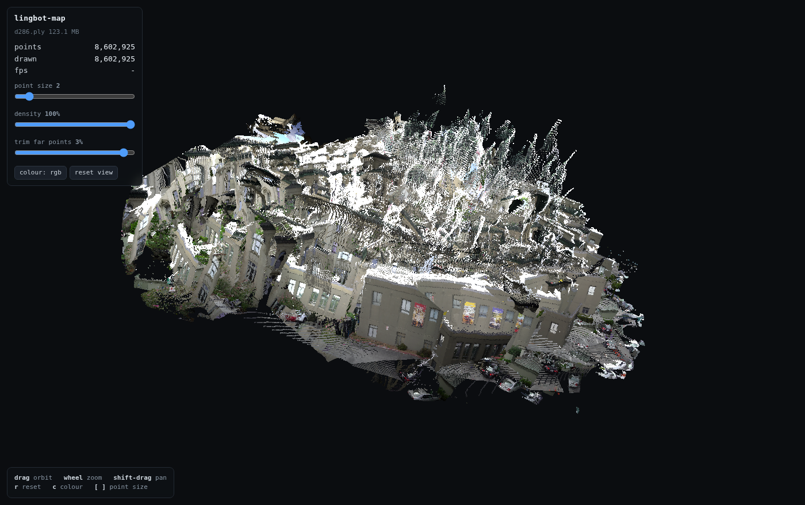

# lingbot-map

Streaming 3-D reconstruction, in pure NURL. Hand it a folder of video
frames; it hands back a world-space point cloud, plus a camera pose and a
depth map for every frame — one frame at a time, no per-scene
optimisation, no structure-from-motion pass.

It is a port of [LingBot-Map](https://github.com/robbyant/lingbot-map),
the feed-forward 3-D foundation model, and it runs the same 1.16 B
parameter checkpoint the reference does. Every stage is checked against
the reference PyTorch implementation, and on the same GPU it is several
times faster end to end. The whole deliverable is compared against the
reference over whole sequences — same frames, same checkpoint, cloud
against cloud — under [How close is it
really](#how-close-is-it-really).

## Install

```
nurlpkg install lingbot-map
```

## Reconstruct something

```
lingbot-map my-frames/
```

That is the whole command: a folder of `.png` or `.jpg` frames in, a
point cloud out. The first run downloads the 4.6 GB checkpoint from
Hugging Face and caches it under `~/.nurl/models`; every run after that
starts straight away.

```
frames 286 -> cloud.ply
model  /home/wau/.nurl/models/lingbot-map/lingbot-map.pt
frame 1/286  33025 points  526 ms  .../courthouse/000000.png
frame 2/286  66564 points  157 ms  .../courthouse/000001.png
frame 3/286  98930 points  158 ms  .../courthouse/000002.png
...
frame 286/286  8602925 points  410 ms  .../courthouse/000285.png
wrote 8602925 points to cloud.ply  (286 frames, 108624 ms)
```

## Look at it



> All 286 frames of the courthouse walk as one reconstruction — facades,
> shopfront posters, the parked cars, the street. Rendered by the viewer
> below from `lingbot-map --conf 3 ...`; the exact view is
> `?yaw=1.15&pitch=0.18&dist=0.60&trim=0.94&roll=0.30`, so you can
> reproduce it.

Point it at a cloud:

```
$ lingbot-map view cloud.ply
viewer  http://127.0.0.1:8080
cloud   cloud.ply  123 MB
Ctrl-C to stop
```

**Open `http://127.0.0.1:8080` in your browser.** That is the whole thing
— the command prints the address and then serves until you stop it with
Ctrl-C. Nothing else is installed and nothing is fetched from the
internet; the page is inside the binary.

If port 8080 is taken, pick another and open the address it prints:

```
$ lingbot-map view cloud.ply --port 9000
viewer  http://127.0.0.1:9000
```

To go from frames to a viewer in one command, the way `demo.py` does, add
`--view` — it reconstructs first and then serves, printing the same
address when it is ready:

```
$ lingbot-map --view ~/dev/lingbot-map/example/courthouse
frames 286 -> cloud.ply
model  /home/wau/.nurl/models/lingbot-map/lingbot-map.pt
frame 1/286  33025 points  526 ms  .../courthouse/000000.png
...
wrote 8602925 points to cloud.ply  (286 frames, 108624 ms)

viewer  http://127.0.0.1:8080
cloud   cloud.ply  123 MB
Ctrl-C to stop
```

Once it is open: **drag** to orbit, **wheel** to zoom, **shift-drag** to
pan, **r** to reset the view, **c** to cycle the colouring, **[** and
**]** for point size.

A particular view can be linked to with URL parameters:
`?yaw=&pitch=&dist=&roll=&ps=&trim=` — angles in radians, `dist` as a
multiple of the automatic framing. `roll` exists because the world frame
is the first camera's, and a hand-held first frame is rarely level.

The three sliders, in the order they matter:

* **trim far points** hides the farthest few percent, and starts at 2%.
  That is almost always sky the depth head placed a long way off, and it
  is the difference between a legible first frame and a white wall. Push
  it further for a cleaner scene; pull it back to 0% to see everything
  the model produced.
* **density** thins the cloud if your machine struggles. The points are
  shuffled once when they load, so 10% is a tenth of the whole scene
  rather than the first tenth of the walk.
* **point size** for how solid the surfaces look.

`cloud.ply` is an ordinary PLY, so MeshLab, CloudCompare, Blender and
`f3d cloud.ply` open it too.

## Where frames come from

A video, or a folder of `.png`/`.jpg`/`.jpeg` files whose names sort
into the order they were shot. A video is just handed over:

```bash
lingbot-map --view walk.mp4          # extract at 10 fps, reconstruct, view
lingbot-map --fps 5 walk.avi         # sample it sparser
```

Frames land in `walk_frames/` next to the file — the same place
`demo.py` puts them — and `--max-frames`, `--stride` and the rest apply
to them unchanged. An **MJPEG `.avi`** is parsed by lingbot-map itself,
in pure NURL; every other codec (H.264 `.mp4`, HEVC, VP9, ...) uses
`ffmpeg` when it is on PATH, and the error tells you so when it is not.

Shooting for reconstruction: move steadily, keep sharp fixed features in
view (corners, signs, textured walls — the model tracks what it can
see), and avoid spinning in place. 10 fps of a walking pace is plenty;
more frames add ghost layers faster than they add coverage.

The example sequences the reference uses — `courthouse`, `loop`,
`university` — come with
[its repository](https://github.com/robbyant/lingbot-map), under
`example/`. Everything below uses one of those, so the numbers are
reproducible.

## More things to try

```bash
# a quick look first: 30 frames instead of all 286
lingbot-map --max-frames 30 ~/dev/lingbot-map/example/courthouse

# the whole walk, but every 20th frame — 15 frames, 4 s
lingbot-map --stride 20 --out sparse.ply ~/dev/lingbot-map/example/courthouse

# every pixel rather than every second one — 4x the points
lingbot-map --pixel-stride 1 --out dense.ply ~/dev/lingbot-map/example/courthouse

# keep more of the uncertain geometry (1.0 is "the model knows nothing")
lingbot-map --conf 1.2 --out loose.ply ~/dev/lingbot-map/example/courthouse

# a checkpoint you already downloaded, and where the time goes
lingbot-map --model ./lingbot-map.pt --profile ~/dev/lingbot-map/example/courthouse

# a few individual frames, in the order you name them
lingbot-map shot0.png shot1.png shot2.png

# a text PLY, for reading with your eyes
lingbot-map --ascii --max-frames 2 --out two.ply ~/dev/lingbot-map/example/courthouse
```

## Options

| | |
|---|---|
| `--model <path\|ref>` | checkpoint to run: a local `.pt`, or a Hugging Face ref such as `robbyant/lingbot-map/lingbot-map.pt`. Default: `$LINGBOT_MAP_MODEL`, else `~/.nurl/models/lingbot-map/lingbot-map.pt`, else that ref is fetched |
| `--out <file.ply>` | where to write the cloud (default `cloud.ply`) |
| `--conf <f>` | keep pixels whose confidence exceeds this (default 1.5, the reference's own `--conf_threshold`) |
| `--pixel-stride <n>` | take every nth pixel on both axes (default 2) |
| `--max-frames <n>` | stop after n frames |
| `--stride <n>` | use every nth frame, applied after `--max-frames` |
| `--fps <n>` | frames per second to take from a video (default 10) |
| `--image-size <n>` | input width in pixels, a multiple of 14 (default 518); smaller = fewer tokens = less memory |
| `--frames <dir>` | a directory of frames; the same as naming it positionally |
| `--ascii` | write an ASCII PLY instead of `binary_little_endian` |
| `--quiet`, `-q` | no per-frame progress |
| `--profile` | per-stage frame timings and a per-kernel GPU profile |
| `--view` | open the viewer on the cloud once it is written |
| `--port <n>` | viewer port (default 8080) |
| `--version`, `--help` | |

The reference's own spellings work too — `--model_path`,
`--image_folder`, `--conf_threshold`, `--first_k`, `--video_path`,
`--fps`, `--image_size` — so a `demo.py` command line mostly transfers.

**Order is the trajectory.** Frames are read in name order, and the model
keeps a cache across frames, so each one is placed relative to the ones
before it. A shuffled directory reconstructs a different scene.

## How it differs from `demo.py`

The model is the same and the numbers agree; the packaging does not.

* **The viewer is a point cloud, not a scene inspector.** `demo.py` ends
  in a viser viewer with camera frusta, per-frame playback and a sky mask;
  `lingbot-map view` orbits the cloud and lets you trim and thin it. Both
  run in a browser on localhost.
* **Video decode is MJPEG-native, ffmpeg otherwise.** `demo.py` shells
  out to OpenCV for every codec; this parses MJPEG AVI itself and uses
  `ffmpeg` for the rest.
* **No scale-frame block.** `demo.py` runs the first `--num_scale_frames`
  (8 by default) frames as **one block with bidirectional attention among
  themselves**, and only then goes frame-by-frame. The port is causal from
  frame 0, which is what `demo.py --num_scale_frames 1` does. Measured on
  12 frames, that alone is worth **3.3% of the cloud** (370 052 points
  against 357 693). Everything in [How close is it
  really](#how-close-is-it-really) compares against the reference driven
  the port's way, so it is a separate gap and is not folded into those
  numbers.
* **Streaming only.** `--mode windowed`, `--keyframe_interval`,
  `--mask_sky` and `--rotate_clockwise_90` have no equivalent here. The
  sliding KV window is what bounds the memory instead of keyframes,
  which is why 286 frames run at a flat 410 ms each; past ~320 frames
  `demo.py` would start dropping to keyframes and this will not.
* **f32 throughout.** `demo.py` casts the aggregator to bf16. In eager
  mode that is *slower* on this card — 155 ms a frame against f32's
  141 — and it is not what the accuracy figures above were measured
  against.

## What you need

* An NVIDIA GPU and the CUDA driver. VRAM goes with the length of the
  sequence and with the frame's token count, and stops growing once the
  sliding KV window fills: landscape frames (518x294, 783 tokens) run
  ~6.8 GB at 8 frames, ~10 GB at 30, ~16.4 GB at 286 and beyond.
  **Portrait frames cost ~1.75x** — they crop to 518x518, 1375 tokens —
  and a long portrait video does not fit a 24 GB card at the default
  size. A run that cannot fit says so up front, with the numbers and
  the levers; `--image-size 392` is the usual fix, and `--stride` /
  `--max-frames` cap it further.
* The 4.6 GB checkpoint, which the first run fetches for you. To fetch it
  yourself: `hub pull robbyant/lingbot-map/lingbot-map.pt`, or download
  `lingbot-map.pt` from
  [huggingface.co/robbyant/lingbot-map](https://huggingface.co/robbyant/lingbot-map)
  and pass `--model <path>`. The `-long` and `-stage1` checkpoints in the
  same repository are read the same way — layer counts come off the file
  rather than from a constant.

No Python and no PyTorch. The kernels are CUDA C compiled at run time
through NVRTC, so the driver (`libcuda`) and `libnvrtc` are what you
need at run time, and nothing at all at build time.

## Speed

An RTX 4090, f32 on both sides, same frames, same checkpoint.
`tests/ref_cloud.py` drives `~/dev/lingbot-map` through its own
`inference_streaming` and writes the same cloud, so this is the whole
command against the whole command, not a module against a module:

| frames | reference | this port | |
| ---: | ---: | ---: | --- |
| 1 | 14.6 s | 1.6 s | **9.2x** |
| 4 | 14.5 s | 2.0 s | **7.1x** |
| 12 | 15.8 s | 3.4 s | **4.6x** |
| 20 | 17.2 s | 5.1 s | **3.4x** |

Most of that is the checkpoint: the port reads 4.6 GB straight into
device memory in 1.6 s where `torch.load` plus `load_state_dict` takes
~12.6 s, and that cost is paid once however long the sequence. On
inference alone the two are close — at 20 frames the reference spends
3.7 s and the port about 3.5 s.

Per module, on one frame with the load excluded (`tests/ref_timing.py`,
the same slice `--profile` reports):

| | reference | this port |
| --- | --- | --- |
| aggregator | 77 ms | 100 ms |
| camera head | 54 ms | **16 ms** |
| depth head | 10 ms | 22 ms |
| **one frame** | **141 ms** | **138 ms** |

Ahead on the camera head, behind on the other two, and the sum lands
where the reference's does. End to end, including the 1.6 s checkpoint
load, eight frames take 2.8 s, thirty take 7.5 s and all 286 take 109 s.

A frame costs more the more of the sequence it has to attend to, and then
stops: 157 ms at frame 2, 400 ms by frame 73, and 410 ms at frame 286.
That plateau is the sliding KV window filling up — past 72 frames the
model attends over a bounded cache, so the per-frame cost is flat however
long the walk is.

The reference here is torch in eager mode, which is what `ref_timing.py`
measures on both sides. `demo.py` can also turn on `torch.compile` and
CUDA graphs; that is a faster reference this has not been measured
against.

`--profile` shows where a frame goes, and which kernels it spends it in:

```
prep 33 ms  aggregator 100 ms  camera 16 ms  depth 22 ms  cloud 1 ms
  44%  gk32_gemm_smem     1152 calls    201 us each
  11%  gk32_attn64_32      288 calls    206 us
   9%  gk32_gemv           304 calls    156 us
   7%  gk32_lnormrow       760 calls     53 us
```

## Accuracy

Every stage is checked against the reference itself. Where an oracle can
import the upstream module and drive it, it does, rather than working
from a second reading of the source — a hand-written oracle is just
another chance to make the same mistake, and once did.

These are what the suite prints, worst relative error in each case:

| stage | vs the reference |
|---|---|
| frame preprocessing | identical, every value |
| the `.pt` checkpoint, 1342 tensors | identical to `torch.load` |
| 2-D and 3-D rotary embeddings | 0 |
| patch embedding, one transformer block | 4.4e-15 |
| camera geometry | 2.4e-16 |
| DINOv2 trunk, on a real frame | 6.5e-6 |
| the whole aggregator, four tapped layers | 5.3e-6 |
| two frames through the KV cache | 5.3e-6 |
| KV eviction, 120 frames | 0 |
| eviction against the real model, past the window | 9.3e-6 |
| camera pose, after four refinement passes | 2.3e-7 |
| depth, confidence and world points, end to end | 1.5e-5 |

f32 on both sides. The 1e-6-and-up figures are float32's own noise
accumulating over 72 transformer blocks; the ones near 1e-15 are stages
short enough that nothing accumulates.

**Every one of those is a one- or two-frame measurement.** They say the
arithmetic is right. They do not say what a 300-frame reconstruction
looks like, and the next section does.

## How close is it really

`tests/ref_cloud.py` runs `~/dev/lingbot-map` over the same frames and
writes the same cloud; `tests/cmp_cloud.py` asks whether every point of
one has a point of the other in the same place, relative to the size of
the scene. Both are in the suite as step 20.

| frames | point counts | median displacement | centroid drift |
| ---: | --- | ---: | ---: |
| 1 | 33 024 vs 33 025 | 2.3e-5 | 6.9e-5 |
| 4 | 129 979 vs 129 982 | 2.5e-4 | 2.3e-4 |
| 12 | identical | 2.4e-4 | 1.3e-4 |
| 20 | 589 997 vs 590 002 | 2.4e-4 | 1.2e-4 |

The error is **flat** — frame 20 sits as close as frame 4 — and the
per-frame scale agrees with the reference to ±3e-4 down the whole
sequence. What remains is float32 noise accumulating through two KV
caches, not drift: nothing compounds.

It was not always flat, and the bug is worth recording. Through 0.4.x
the per-frame *clouds* were right and their *placement* wandered — by 20
frames the centroid sat 1.8e-1 of the scene away and the reconstruction
read as rubble. The camera head was running cacheless, so every frame
was posed alone; the reference's `CameraCausalHead` attends causally
over every previous frame's camera token, one KV cache per refinement
pass, and its eviction guard (`tokens-per-frame > 1`) never fires for a
one-token stream, so those caches deliberately hold the entire
trajectory. No per-module test could see it: the aggregator's
activations were flat-correct all along, and pose agreement had only
ever been checked on frame 0, where a cacheless head is
indistinguishable from a causal one.

## How it works

Each frame is resized and cropped to 518 px wide, run through a frozen
DINOv2 ViT-L/14 trunk, then through 24 pairs of transformer blocks that
alternate between attention *within* the frame and causal attention
*across* frames over a KV cache. Four of those pairs are tapped and fed
to two heads: a camera head, which refines a 9-vector pose over four
passes, and a DPT decoder, which gives a depth map and a per-pixel
confidence. Depth plus the pose plus the intrinsics unprojects to
world-space points, and that is the cloud.

The cache is what makes it *streaming*: frame N is placed relative to
every frame before it, so the poses all land in one world frame without
any global optimisation. Past 72 frames a sliding window evicts the
middle of the sequence and keeps the first 8 frames and the last 64,
which is what bounds the memory.

## Tests

```
cd packages/lingbot-map && ./tests/lingbot_map_test.sh
```

Twenty-one steps, each building its own NURL binary. Steps that need the
checkpoint, a python with torch, or the upstream package skip cleanly
when those are absent — that is the fast path, and it is what CI runs.
For the full set, set `PYTORCH_PY` (or drop a venv at the repo root as
`.venv-oracle`) and check out the upstream package at `~/dev/lingbot-map`.

Step 21 renders the viewer in a headless Chrome and needs `google-chrome`
or `chromium` on PATH; it skips cleanly without one and needs no
checkpoint. Step 20, the end-to-end differential, additionally needs a **CUDA** torch —
`.venv-oracle` is deliberately a CPU build, since correctness is all the
other steps need. Set `LINGBOT_CUDA_PY`, or drop one at the repo root as
`.venv-cuda`, and `LINGBOT_CUDA_DEV` if the first CUDA device is not the
one you want.

## Under the hood

[`docs/porting-notes.md`](docs/porting-notes.md) — how the port was
built, every trap that was silent when it was wrong, and what the speed
work actually turned out to be. [`docs/checkpoint.md`](docs/checkpoint.md)
— all 1342 tensors read out of the real file.

Built on [`torchpt`](../torchpt) (reads the `.pt` without executing its
pickle), [`gpukit`](../gpukit) (the kernels) and
[`image`](../image) (PNG/JPEG decode and a PIL-compatible bicubic
resize).
