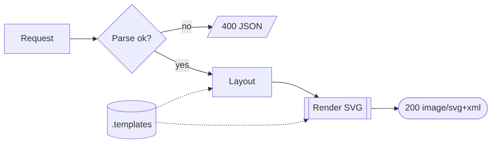

# mermaid-server — mermaid flowcharts to SVG, over HTTP and MCP

A multi-threaded HTTP server that turns mermaid `flowchart` source into an
SVG image, and — in the same process, on the same port — an **MCP server**
that does the same for an LLM agent. Pure NURL: no headless browser, no
`node_modules`, no mermaid.js. One static binary and a directory of
templates.

```
$ mermaid-server
mermaid-server 0.1.0 — 3 template(s), 12 worker(s); MCP at /mcp
http: serving http://127.0.0.1:8808

$ curl -s --data-binary @flow.mmd localhost:8808/render > flow.svg
```

The look is **not** compiled in. Every colour, stroke width, radius, font
and gap comes from a *template* read from an external directory of TOML
files at startup, and a request picks one by name. Adding a look is adding
a file.

## The pipeline



`parse` reads the flowchart into a node/edge graph, `layout` ranks it into
layers and places it, `render` writes the SVG. The template is consulted by
the last two: it decides how big a node has to be for its label as much as
it decides what colour that node is.

## HTTP

| Route | |
| --- | --- |
| `POST /render` | body = mermaid source → `image/svg+xml` |
| `GET /render?src=…` | same, source in the query — drops into an `` |
| `POST /render.json` | → `{ "svg", "width", "height", "nodes", "edges", "warnings" }` |
| `GET /templates` | the loaded templates, their descriptions and which is default |
| `GET /healthz` | `ok` |
| `GET /` | a self-contained live playground: type on the left, SVG on the right |
| `POST\|GET\|DELETE /mcp` | MCP over Streamable HTTP |

Pick a template with `?template=<name>` or an `X-Template:` header; omit it
for the set's default. A parse error is a `400` with the line and column:

```json
{"error":"unterminated node shape — no closing delimiter on this line","line":2,"column":3}
```

Statements the parser knows about but does not model (`classDef`, `class`,
`style`, `linkStyle`, `click`, the accessibility statements) are skipped
with a warning rather than failing the render. Warnings ride out on the
`X-Mermaid-Warnings` response header, in `render.json`'s `warnings` array,
and inside the SVG's own `<desc>`.

CORS is permissive, so a browser on another origin can render straight from
the server.

## MCP

The same process serves MCP at `/mcp`, and `--stdio` speaks the stdio
transport instead — which is how an editor agent usually wants it:

```
claude mcp add mermaid -- ~/.nurl/bin/mermaid-server --stdio
```

| Tool | |
| --- | --- |
| `mermaid_render` | `{ source, template? }` → the SVG markup |
| `mermaid_templates` | the template names `mermaid_render` accepts |
| `mermaid_validate` | parse only: node/edge counts, or the first error's line and column |

## CLI

```
mermaid-server                      serve HTTP (and MCP at /mcp)
mermaid-server render [FILE]        render one diagram to stdout (stdin if no FILE)
mermaid-server templates            list the loaded templates
```

| Flag | |
| --- | --- |
| `--host HOST` · `-p, --port PORT` | bind address, default `127.0.0.1:8808` |
| `-w, --workers N` | worker threads; default one per CPU |
| `--templates DIR` | template directory |
| `-t, --template NAME` | which template `render` uses |
| `-o, --out FILE` | write the SVG to a file |
| `--stdio` | speak MCP over stdin/stdout |
| `-q, --quiet` | no startup banner |

## Templates

The directory is resolved in this order, and the first one that exists
wins:

1. `--templates DIR`
2. `$MERMAID_TEMPLATES`
3. `./.templates`
4. `$NURL_HOME/share/mermaid-server/.templates` (default `~/.nurl/…`)

`nurlpkg install mermaid-server` stages the three shipped templates into
(4), so an installed server starts with no further setup.

(1) and (2) are *explicit*: if either names a directory that cannot be
loaded, the server says so and exits rather than quietly serving a
different one. Every `*.toml` in the directory is one template, named by
its `name =` key or by its file stem. The default is the one with
`default = true`, else the one called `default`, else the first by file
name.

Three ship with the package: `default` (indigo on white), `dark` (slate on
near-black) and `blueprint` (white ink on blueprint blue).

### Writing one

Keys are dotted paths. A lookup for a node tries `node.<shape>.<key>` and
falls back to `node.<key>`; an edge tries `edge.<style>.<key>` then
`edge.<key>`. Shapes are `rect round stadium subroutine cylinder circle
diamond hexagon parallelogram parallelogram-alt trapezoid trapezoid-alt
flag`; line styles are `solid dotted thick`. Anything omitted falls back to
a built-in default, so a template can be three lines long.

```toml
name = "minimal"
description = "Two colours and nothing else."

[canvas]
background = "#ffffff"
font_size = 14

[node]
fill = "#f4f4f5"
stroke = "#18181b"
stroke_width = 1.5     # floats keep their exact spelling in the SVG
text = "#18181b"

[edge]
stroke = "#71717a"

[edge.dotted]
dash = "5 5"
```

| Group | Keys |
| --- | --- |
| `[canvas]` | `background` `padding` `font_family` `font_size` `css` |
| `[layout]` | `rank_gap` `node_gap` `pad_x` `pad_y` `min_width` `min_height` `line_height` `char_scale` `lane_width` |
| `[node]` | `fill` `stroke` `stroke_width` `dash` `radius` `text` `font_weight` `inset` `grow_x` `grow_y` · `rim` (cylinder) · `bar` (subroutine) |
| `[edge]` | `stroke` `stroke_width` `dash` `arrow` `arrow_size` `text` `font_size` `label_fill` `label_stroke` `label_radius` `label_pad` `loop_size` |

`canvas.css` is appended verbatim to the generated `<style>` block. CSS
outranks the presentation attributes the renderer writes, so a template can
restyle anything the key set does not cover yet — the elements carry
`.mmd-node`, `.mmd-s-<shape>`, `.mmd-edge`, `.mmd-l-<style>`, `.mmd-label`,
`.mmd-edge-label`, `.mmd-arrow`, `.mmd-bg`, and every node keeps its
mermaid id in `data-id`.

The template *source* is a discriminated kind (`MMD_TSRC_DIR` today), so a
registry- or HTTP-backed loader is a second branch in `mmd_templates_load`
and nothing else in the program changes.

## The mermaid subset

Supported: the `graph` / `flowchart` header with `TD` `TB` `LR` `BT` `RL`;
all thirteen node shapes (`A[r] A(r) A([s]) A[[s]] A[(c)] A((c)) A{d}
A{{h}} A[/p/] A[\p\] A[/t\] A[\t/] A>f]`); quoted labels; `<br/>` line
breaks and the `&lt; &gt; &amp; &quot;` entities; links `--- --> -.- -.->
=== ==> --o --x <-->` with any run length; both label spellings
(`-->|text|` and `-- text -->`); chains `A --> B --> C`; `&` node groups;
`;` statement separators and `%%` comments.

Not supported yet: `subgraph` — a **hard error** rather than a warning,
because dropping a subgraph changes what the diagram means, not just how it
looks. Other diagram types (`sequenceDiagram`, `classDiagram`, …) are
rejected by name at the header.

## Layout

A layered, Sugiyama-style pass, all in integer arithmetic:

1. **size** — each node measured from its label with a glyph-width table
   (a server has no font metrics), the template's font size and padding,
   and a per-shape allowance so a diamond is not the size of its text.
2. **rank** — a depth-first search marks the back edges that would make the
   graph cyclic; a longest-path pass over what remains assigns layers. A
   cycle is laid out, not rejected.
3. **split** — a link crossing more than one layer boundary is cut into
   unit-length segments joined by dummy nodes, one per layer it passes
   through. The dummies are laid out like any other node, so a long link
   gets its own corridor instead of being drawn straight through whatever
   sits between its endpoints, and the renderer draws it as a polyline
   through those bends.
4. **order** — barycentre sweeps down and up the layers, dummies included.
5. **place** — cross-axis positions from the ordering, pulled twice towards
   each node's neighbours and de-overlapped; layer positions from the
   running maximum layer thickness.

Link ends are clipped to the real shape — a rectangle on its frame, a
diamond on `|x|/w + |y|/h = 1`, a circle on its ellipse — and arrow heads
are drawn as geometry rather than SVG markers, which keeps their size and
colour under the template's control.

## Tests

`./tests/mermaid_test.sh` runs three tiers: the unit suite
(`tests/mermaid_test.nu` — parser, templates, layout, renderer, MCP
dispatch), the CLI, and a live server driven over curl including the MCP
transport on both `/mcp` and `--stdio`.

## Memory

The template set is built once, before the listener opens, and is read-only
while serving — so the worker pool needs no lock on the render path. Each
request's parse, layout and render are independent and reclaim everything
they allocate; verified leak-free under ASan/LSan across a request loop.
