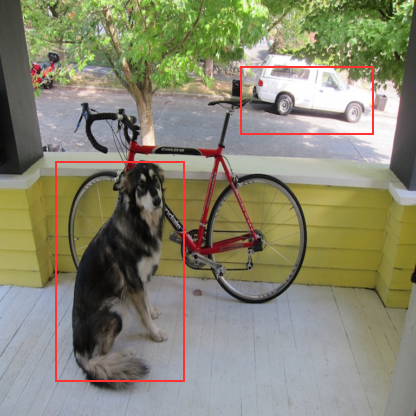

# objdet — object detection from pure NURL, on the GPU

Detect objects in an image or video feed using a tiny-YOLOv2-style **ONNX**
model — written entirely in NURL. The image is decoded natively through
[`packages/image`](../image) (PNG, baseline+progressive JPEG, PPM — no
ImageMagick), the network runs on the **GPU** through
[`packages/onnx`](../onnx) (every layer a CUDA-C kernel compiled at runtime
via NVRTC — no external inference engine), and the YOLO grid is decoded into
labelled boxes with non-max suppression.

Verified against **onnxruntime** on the ONNX model-zoo `tinyyolov2-8.onnx`:
identical class scores and boxes.

```
$ objdet tinyyolov2-8.onnx dog.jpg out.png
device: NVIDIA GeForce RTX 4090
image 416x416
detections:
  dog 0.764437  box[x=55 y=161 w=129 h=220]
  car 0.763744  box[x=240 y=66 w=133 h=68]
wrote out.png
```



## Usage

```
objdet <model.onnx> <image.{png,jpg,ppm}> [out.{png,jpg,ppm}] # single image
objdet <model.onnx> --video <in_dir> <out_dir> <count>        # frame sequence
```

Stills are decoded and encoded natively (PNG / JPEG / PPM, by extension) —
feed it a photo straight from a camera. `in_dir`/`out_dir` hold
`frame00000.ppm`, `frame00001.ppm`, … The video mode reuses one GPU engine
(kernels compiled once) across all frames; use ffmpeg for the container:

```
objdet tinyyolov2-8.onnx photo.jpg out.png

ffmpeg -i clip.mp4 -vf fps=10 in/frame%05d.ppm     # video → frames
objdet tinyyolov2-8.onnx --video in out $(ls in | wc -l)
ffmpeg -framerate 10 -i out/frame%05d.ppm out.mp4  # frames → video
```

Non-416×416 images are bilinear-resized to the model input; boxes are
reported in the original image's pixel coordinates.

## Getting the model

The model is not bundled (≈63 MB). Fetch the ONNX model-zoo detector:

```
curl -L -o tinyyolov2-8.onnx \
  https://github.com/onnx/models/raw/main/validated/vision/object_detection_segmentation/tiny-yolov2/model/tinyyolov2-8.onnx
```

Any ONNX model with the same shape works: NCHW float input, a
`Conv`/`BatchNormalization`/`LeakyRelu`/`MaxPool` backbone, and a
`[1, 125, 13, 13]` YOLOv2/VOC grid output (5 anchors × (5 + 20 classes)).

## How it works

```
image.ppm ─image.nu─▶ 416×416 NCHW ─onnx(GPU)─▶ [1,125,13,13] grid ─detect.nu─▶ boxes ─▶ annotated.ppm
           load+resize             tiny-yolov2                      decode + NMS      draw
```

- **`src/image.nu`** — PPM (P6) read/write, bilinear resize, box drawing,
  NCHW float packing. Pure NURL over a byte `Vec`.
- **`src/detect.nu`** — YOLOv2 grid decode (per cell × anchor: sigmoid box,
  exp size, softmax class), the 20 VOC class names, and non-max
  suppression. CPU — the grid is small (13×13×5).
- **`src/main.nu`** — the CLI: load model + image, run on the GPU via
  `packages/onnx`, decode, print, draw, write.

The network itself runs entirely on the GPU; only the lightweight decode
runs on the CPU. The single native dependency (CUDA driver + NVRTC) lives
in the `gpu` package, so a GPU-less host is unaffected.

## Tests

`tests/detect_test.nu` covers the model-free logic (PPM round-trip, resize,
NCHW packing, grid decode on a synthetic grid, NMS, class names) and runs
without a GPU. The end-to-end GPU path is the demo above. `tests/data/`
holds the reference generator (`gen_ref.py`, needs `onnx`+`onnxruntime`).

## Requirements

- NVIDIA driver (`libcuda.so`) + NVRTC (`libnvrtc.so`) — via `onnx` → `gpu`.
- Images as PPM (P6); `ffmpeg`/ImageMagick for other formats and video.

## Status

v0.1.0 is a proof-of-concept targeting tiny-yolov2 (VOC, 20 classes). The
op set it relies on lives in `packages/onnx` and is built to extend toward
YOLOv3/v5/v8-class detectors (more ops, multi-scale heads).
