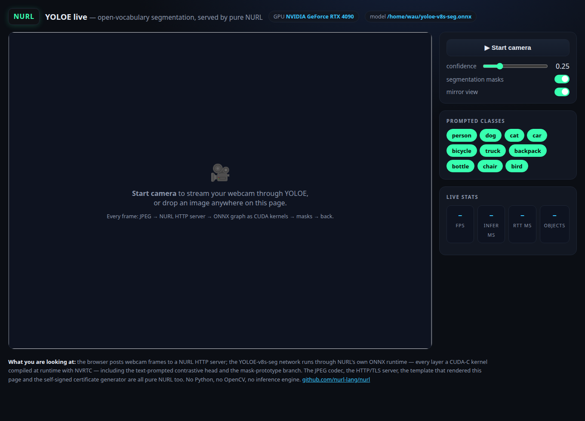
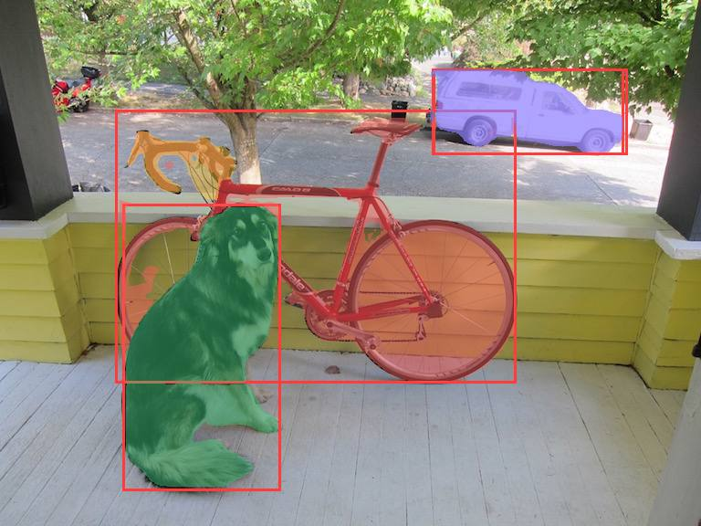
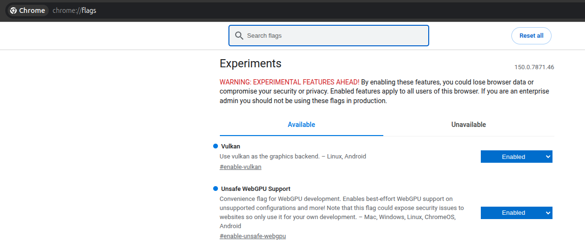

# yoloe-demo — live YOLOE in the browser, served by pure NURL

Open a web page, start your webcam, and watch **open-vocabulary object
detection + instance segmentation** stream back at you in real time —
with **no Python, no OpenCV, no inference engine and no web framework**
anywhere in the stack.



Every frame makes this round trip:

```
browser webcam ── JPEG POST ──▶ http package        pure-NURL HTTP/TLS server
                                image package       JPEG decode (pure NURL)
                                onnx package        YOLOE-v8s-seg, every layer a
                                                    CUDA-C kernel via NVRTC
                                yoloe package       decode + NMS + mask branch,
                                                    masks composited on the frame
                                image package       JPEG encode
               ◀── JSON + jpeg ─┘                   boxes/labels drawn in-browser
```



The page itself is rendered by the **template** package, and `--tls`
mints a self-signed P-256 certificate at startup with **std/x509_gen** —
pure NURL from the TCP socket to the mask pixels.

## Run it

You need the YOLOE-seg ONNX export + its prompt vocabulary (see
`packages/yoloe` — `tools/export.py` produces both) and an NVIDIA GPU
with the driver + NVRTC installed.

```sh
cd packages/yoloe-demo
# in a repo checkout, link the sibling packages once (nurlpkg install does
# the same from nurl.toml for registry installs):
mkdir -p deps && for d in yoloe http template image onnx gpu; do ln -sfn ../../$d deps/$d; done
../../nurl.sh src/main.nu demo
./demo --model ~/yoloe-v8s-seg.onnx --classes ~/yoloe-classes.txt
# → serving http://0.0.0.0:8090
```

Open **http://localhost:8090**, press *Start camera*, done.

To use it from a phone or another machine on the LAN, browsers require a
secure origin for the camera — start with `--tls` and accept the
self-signed-certificate warning:

```sh
./demo --model ... --classes ... --tls
# → serving https://0.0.0.0:8090
```

| Flag | Default | |
| --- | --- | --- |
| `--model FILE` | *(required)* | YOLOE-seg `.onnx` export |
| `--classes FILE` | *(required)* | prompt vocabulary, one class per line (must match the export) |
| `--port N` / `--host A` | `8090` / `0.0.0.0` | listen address |
| `--gpu N` | `0` | CUDA device ordinal |
| `--tls` | off | HTTPS with a fresh self-signed cert |
| `--page FILE` | `views/index.html` | the demo page template |

## Free-text prompting

With the **promptable export**, the vocabulary is no longer baked in: type
anything — `coffee mug`, `red car`, `a person waving` — press Enter (or
comma, or *Add*), and the server tokenizes the text with the CLIP BPE
(pure NURL), runs the **MobileCLIP text encoder on the GPU through the
same onnx runtime** (~65 ms), writes the embedding into a free prompt
slot, and the very next frame detects it. New chips toggle like the seed
ones. The K=32-slot graph keeps unused slots inert (zero embeddings).

```sh
# one-time exports (torch + ultralytics + onnxsim in a venv; see tools/)
python tools/export_promptable.py ~/yoloe-export
python tools/export_text_encoder.py ~/yoloe-export

./demo --model ~/yoloe-export/yoloe-promptable-k32.onnx \
       --classes ~/yoloe-classes.txt \
       --text-encoder ~/yoloe-export/text_encoder_n1.onnx
```

The CLIP BPE merge table and the demo page template are **built into
the binary** (generated into `yoloe/src/clip_merges_data.nu` and
`src/index_html_data.nu` by `yoloe/tools/embed_merges.py` /
`tools/embed_page.py`), so an installed `yoloe-demo` needs no asset
files on disk. `--merges FILE` / `--page FILE` override them.

`POST /prompt` (body = the prompt text) → `{ id, name, n }`; 400 on an
empty prompt, 409 when all 32 slots are used. The decode argmaxes only
over *enabled* classes, so a custom prompt isn't shadowed by a disabled
seed class of the same object (`a dog` 0.63 vs `dog` 0.88).

Both graphs are verified against onnxruntime: the text encoder to ~4e-7
per embedding, the K=32 detector to `PROMPTABLE FORWARD MATCH` on
`packages/yoloe/tests/fwd2.nu`.

## The page

* **Start camera** — streams the webcam through the model; **drop any
  image** on the page to run a single frame without a camera.
* **Prompted classes** — chips toggle which of the model's prompt words
  are shown (server-side filter), and with `--text-encoder` a free-text
  input adds new ones live.
* **Confidence slider** and a **masks on/off** switch, applied per frame.
* **Live stats** — fps, server inference ms, round-trip ms, object
  count, and a per-detection list.
* `?auto=1` starts the camera on load (kiosk mode).

## API

`POST /detect` with a JPEG/PNG body. Query: `conf=` (0..1, default
0.25), `masks=` (default 1), `on=` (comma-separated class ids; absent =
all). Response:

```json
{ "ms": 108, "n": 2,
  "dets": [ { "n": "dog", "s": 0.88, "c": 1, "k": 0,
              "x": 138, "y": 227, "w": 167, "h": 306 } ],
  "img": "data:image/jpeg;base64,..." }
```

`k` is the instance colour index (the page's box palette matches the
server's mask palette). `GET /health` answers `ok`.

## In-browser compute (wasm CPU · WebGPU)

The demo runs the **entire network in the browser tab** as an
alternative to the server round-trip — the same pure-NURL onnx runtime,
compiled to **wasm32-wasi** with the gpu package's kernels **precompiled
and linked in** (no NVRTC, no server GPU). When `web/yoloe_detect.wasm`
is present the page shows a **compute: server · GPU / this browser ·
wasm** selector; switch to *wasm* and the frames never leave the machine.

```
webcam → canvas → SharedArrayBuffer → web worker
   → yoloe_detect.wasm (pure-NURL onnx runtime, static CPU kernels)
   → masked RGB + detections → canvas
```

The **compute** selector offers two client-side engines:

* **this browser · wasm (CPU)** — the static kernels on one CPU core
  (`-msimd128`), ~20 s/frame at 640×640. Correctness/portability path.
* **this browser · WebGPU** — the *same* onnx runtime with every kernel
  a WGSL compute shader (packages/gpu backend 3) on the browser GPU:
  **~1.1 s/frame, ~20× faster than the CPU path** and matching the
  server GPU / onnxruntime within tolerance. This is the whole network
  running on your GPU with no server round-trip.

### Getting a real GPU adapter (Linux Chrome)

The page shows which adapter the browser actually handed over. If it
warns about a **software adapter** (SwiftShader), WebGPU is running on
the CPU — expect wasm-CPU-class frame times (~20 s), not GPU ones. On
Linux, Chrome does this **by default**: WebGPU falls back to SwiftShader
unless the Vulkan backend is enabled. To run on the real GPU:

1. open `chrome://flags`,
2. set **Vulkan** (`#enable-vulkan`) to **Enabled**,
3. set **Unsafe WebGPU Support** (`#enable-unsafe-webgpu`) to **Enabled**,
4. relaunch Chrome.



The flags apply to the whole browser (the second one is a development
convenience flag — Chrome's own warning applies), so consider a separate
profile if that bothers you. On Windows and macOS WebGPU uses the real
GPU out of the box and none of this is needed.

Both share one module: `wasm_detect.nu` picks the backend at runtime
(`host_use_webgpu`); `web/worker.js` supplies the WebGPU host
(`packages/gpu/web/webgpu.js`) and drives the one async op — the GPU
readback (`GPUBuffer.mapAsync`) — through Asyncify so the synchronous
NURL `gpu_download` returns data in wasm memory.

Build it (one-time; needs a built `./build/nurlc`, zig which wasmbuilder
auto-provisions, and binaryen for the asyncify pass):

```sh
./tools/build_wasm.sh   # → web/yoloe_detect.wasm (static CPU + WebGPU) + the JS host
```

At runtime the page fetches the module, the detector `.onnx` (`/wasm/model`)
and the current vocabulary embeddings (`/tpe`), spins up `web/worker.js`,
and drives it over a `SharedArrayBuffer` — so the page is served with
`Cross-Origin-Opener-Policy: same-origin` +
`Cross-Origin-Embedder-Policy: require-corp` (browsers only expose
`SharedArrayBuffer` on isolated pages). Free-text prompts work in wasm
mode too: `/prompt` returns the embedding (encoded on the server GPU),
the page pulls the new `/tpe` slot and feeds it to the worker, so both
engines share one vocabulary.

The worker runs off the UI thread, so its `host_frame` import can block
on `Atomics.wait` while the module loops. The **WebGPU** engine reaches
~1.1 s/frame on an RTX 4090 (every layer a WGSL compute shader); the
**wasm-CPU** engine is ~20 s/frame on one core (`-msimd128`) — a
correctness/portability fallback. Both match the server GPU /
onnxruntime within the `fwd2` tolerance (max abs err ~0.02).

## Performance

On an RTX 4090 a 640×480 frame takes ~110 ms server-side (≈7–9 fps
end-to-end in the browser) with masks on. The budget is dominated by the
pure-NURL pixel stages (letterbox, JPEG codec), not the network — the
GPU inference itself is a few milliseconds. Kernels compile once at
startup (`warmup` line); the first frame is never slow.

The server is single-threaded on purpose: one GPU engine, sequential
frames, no locking. RSS is flat under sustained load (see the test).

## Tests

`./tests/demo_test.sh` builds the server, starts it against the real
model, and drives `/detect` the way the browser does: baseline
detections on a known image, `on=` class filtering, `conf=` gating,
masks toggle, garbage-body → 400, and a 60-frame sustained run with an
RSS leak watch. Skips cleanly (exit 0) when no model or GPU is
available, so CI stays green. When `web/yoloe_detect.wasm` + node are
present it also drives the real `web/worker.js` in a node worker thread
(`tests/wasm_worker_test.mjs`) and checks the dog is detected and its
mask composited into the returned frame.

## Notes

* The in-browser engines are the **CPU** (static kernels) and the
  **WebGPU** backend (packages/gpu backend 3 — the onnx kernels as WGSL
  compute shaders). The WGSL kernels are verified on a real GPU via Deno
  (`packages/gpu/tests/webgpu_test.sh`); the full detector forward and
  the shipped `web/worker.js` are verified via Deno Workers
  (`tests/webgpu_worker_test.mjs`, exercised by `demo_test.sh`).
* With the plain `--model` export the vocabulary is baked at export
  time; the promptable K=32 export + `--text-encoder` (see above) lifts
  that at runtime.
