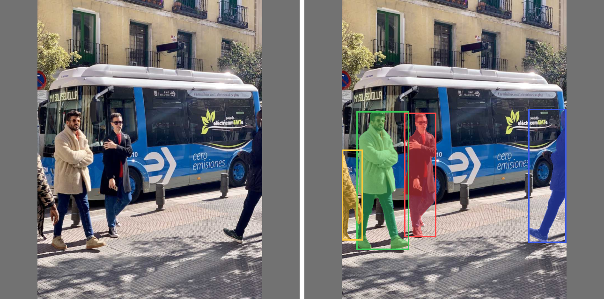
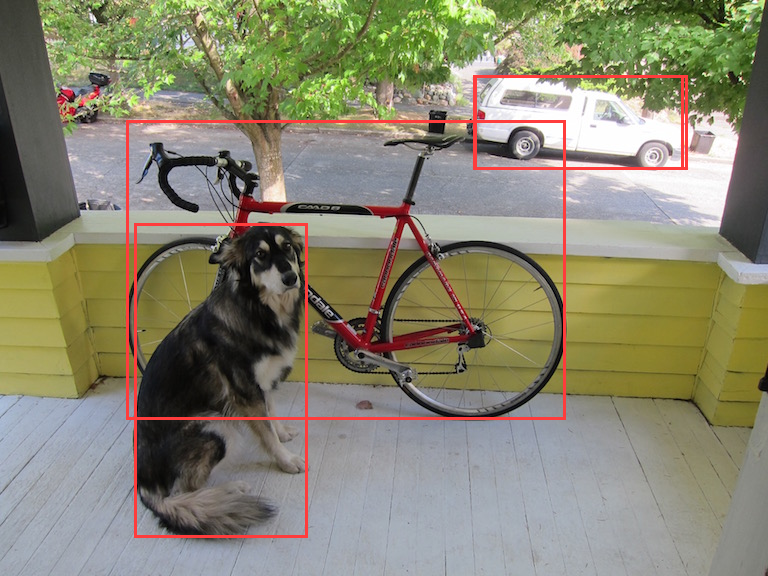
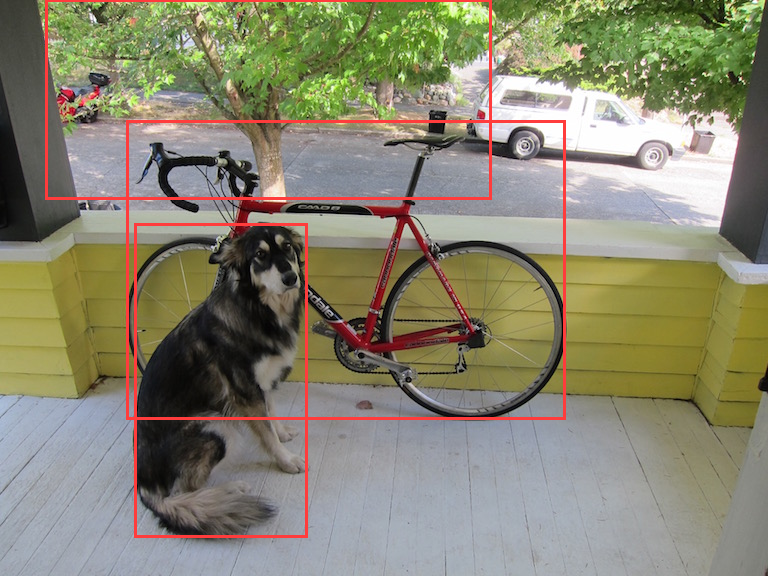

# yoloe — promptable open-vocabulary object detection, pure NURL on the GPU

A NURL port of **YOLOE** ([THU-MIG, "Real-Time Seeing Anything", ICCV
2025](https://github.com/THU-MIG/yoloe)). You *name* the classes you want —
`dog`, `bicycle`, `a person on a bike` — and the model finds them, with no
fixed label set. The detector runs on the GPU through
[`packages/onnx`](../onnx) (every layer a CUDA-C kernel compiled at runtime
via NVRTC — no external inference engine), and promptability comes from
YOLOE's **region-text contrastive head**.

> **Status: M6 done — instance segmentation, live from a webcam.** The full
> YOLOE network runs on the GPU in pure NURL and matches onnxruntime (M2).
> The detector decodes, NMS-es, and draws boxes (M3). The **prompt vocabulary
> is a runtime input** (M4) and the **MobileCLIP text path is pure NURL** (M5,
> bit-exact). And now **instance masks** (M6): the segmentation
> mask-prototype branch (`ConvTranspose` 2× upsample) runs on the GPU — the
> proto tensor matches onnxruntime to **max abs err ~6e-5** — and the mask
> decode (coefficients · prototypes → threshold → crop → bilinear overlay)
> paints each object's silhouette. The frames can come **straight off a
> webcam**, captured in pure NURL via Video4Linux2 (`open`/`ioctl`/`mmap`,
> YUYV→RGB) — no ffmpeg, no OpenCV.
>
> Instance segmentation on the bus photo (input → masks), pure NURL on the GPU:
> 
>
> Boxes only: 
>
> Same model, prompts supplied at runtime (`skateboard frisbee … tree wheel
> … dog bicycle`): 

## Install & usage

```
nurlpkg install yoloe          # builds the `yoloe` command on your PATH
yoloe                          # prints the full help
```

The `yoloe` command has three flag-driven sub-commands:

```
yoloe detect --model M --classes C --image IMG [--out OUT]    boxes
yoloe seg    --model M --classes C --image IMG [--out OUT]    boxes + masks
yoloe cam    --model M --classes C [options]                 live webcam
```

| flag | meaning |
|---|---|
| `--model <model.onnx>` | a YOLOE-seg export from `tools/export.py` (→ `yoloe-v8s-seg.onnx`); not bundled (~45 MB) |
| `--classes <classes.txt>` | the vocabulary, **one prompt word per line** — swap it (and the model) to detect a different set of objects |
| `--image <image.ppm>` | input for `detect`/`seg`, a binary PPM (P6): `convert photo.jpg photo.ppm` |
| `--out <path>` | `detect`/`seg`: the annotated output image; `cam`: a directory to save frames to (created if missing) |
| `--device <dev>` | `cam` webcam device (default `/dev/video0`) |
| `--frames <N>` | `cam`: stop after N frames — **omit to run until Ctrl-C** |
| `--boxes` | draw bounding boxes |
| `--mask` | draw the segmentation masks (alias `--segment`) — **neither flag ⇒ both; pick one for just that** |
| `--window` | `cam`: show in a real GUI window (X11) |
| `--terminal` | `cam`: show in the terminal (truecolor half-blocks) |
| `--no-show` | `cam`: don't display (e.g. when only `--out`-saving) |
| `--gpu <N>` | CUDA device ordinal to run on (default `0`) — pick the card on a multi-GPU box |

**`yoloe cam` shows the segmented feed live.** By default it opens a **real
GUI window** (X11, full webcam resolution) when `$DISPLAY` is set, and
otherwise draws into the **terminal** as true-colour half-blocks (two
area-averaged pixels per character cell) — which also works over SSH, with no
X11. Force either with `--window` / `--terminal`. With no `--frames` it
streams until you quit (any key / the window's close button, or Ctrl-C in the
terminal); add `--out frames/` to also save each frame as a PPM. A half-block
cell holds two independently-coloured pixels — the most a colour terminal can
show — so the
preview's resolution is the terminal's cell grid: a bigger window (or smaller
font) gives a sharper picture.

```
yoloe seg --model yoloe-v8s-seg.onnx --classes classes.txt --image dog.ppm --out out.ppm
yoloe cam --model yoloe-v8s-seg.onnx --classes classes.txt              # live, in the terminal
yoloe cam --model yoloe-v8s-seg.onnx --classes classes.txt --frames 60 --out frames/
ffmpeg -framerate 10 -i frames/frame%05d.ppm seg.mp4                    # saved frames → video
```

`example/classes.txt` holds the default vocabulary from `tools/export.py`.

### How the masks work

The exported YOLOE-seg model has two outputs: `output0` `[1, 4+nc+32, 8400]`
(boxes + class scores + 32 mask coefficients) and `output1` `[1, 32, 160,
160]` (the mask prototypes). For each surviving detection the prototypes are
combined by its coefficients, thresholded (`sigmoid > 0.5`), cropped to the
box, bilinearly upsampled, and blended as a translucent colour — exactly
`ops.process_mask(..., upsample=True)` in the reference. The proto branch (a
`ConvTranspose` 2× upsample, added to `packages/onnx`) is verified
element-wise against onnxruntime (`tests/seg_fwd.nu`: max abs err ~6e-5 over
all 819 200 proto floats).

### The webcam path is pure NURL

`yoloe cam` captures frames straight off a V4L2 webcam **and draws them in the
terminal** — **no ffmpeg, no OpenCV, no X11**. `src/v4l2.nu` does
`open`/`ioctl`/`mmap` on the kernel's video ABI, converts YUYV → RGB with the
BT.601 integer transform, and uses memory-mapped streaming buffers;
`src/display.nu` renders each segmented frame as 24-bit-colour half-blocks
(`▀`, two pixels per cell), sized to the terminal via `TIOCGWINSZ` and homed
each frame so the feed updates in place like a video. One GPU engine and one
camera stream are reused across all
frames. (Needs read access to the device — `ls -l /dev/video0`.)

### Runtime-promptable variant

`src/prompt.nu` (model from `tools/export_promptable.py`) takes the prompt
**text embeddings** as a runtime input instead of baking the vocabulary in:

```
NURL_STDLIB=<repo> ../../nurl.sh src/prompt.nu
./src/prompt <model.onnx> <tpe.f32> <classes.txt> <image.ppm> [out.ppm]
```

`tpe.f32` is `K×512` raw MobileCLIP text features and `classes.txt` the K
prompt words — both produced by `tools/gen_tpe.nu` / `tools/gen_tpe.py`. Swap
them (no re-export) to detect different objects with the *same* model.

### Building from source

```
nurlpkg install                                   # symlink deps/
NURL_STDLIB=<repo> ../../nurl.sh src/main.nu      # build the `yoloe` command
./src/main seg yoloe-v8s-seg.onnx example/classes.txt dog.ppm dog-out.ppm
```

## Why this is the crown jewel

The existing stack already runs real CNNs on the GPU from pure NURL:
`packages/gpu` (CUDA driver + NVRTC), `packages/onnx` (an ONNX runtime),
`packages/objdet` (tiny-yolov2, fixed 20 classes). YOLOE goes further on
every axis:

- **Open vocabulary** — detect arbitrary classes named at runtime, not a
  fixed list. This is *promptable* detection.
- **A modern architecture** — YOLOv8 backbone (C2f, SPPF), an FPN/PAN neck
  (upsample + concat), and an anchor-free DFL detection head.
- **Vision-language** — text prompts are embedded by a MobileCLIP text
  transformer; detection scores each region's visual embedding against the
  text embeddings.

## How YOLOE works (and how NURL will run it)

```
                          ┌─ box head (cv2) ── DFL ──▶ xywh boxes
image ─▶ backbone+neck ─▶─┤
        (YOLOv8, GPU)     └─ embed head (cv3) ─▶ region embeddings ─┐
                                                                    ├─▶ class logits
prompt words ─▶ MobileCLIP text encoder ─▶ text embeddings ────────┘   (region · text)
```

The **BNContrastiveHead** is the key: class logits =
`BatchNorm(region_embed) · text_embed × exp(scale) + bias` — a matmul
between per-region visual embeddings and the prompt text embeddings.
YOLOE's `fuse()` bakes the text embeddings into a 1×1 conv (zero inference
overhead → a fixed-vocab YOLOv8); keeping the head **un-fused** makes the
text embeddings a runtime input, which is how NURL gets *runtime*
promptability.

## M1 results (done)

Exported `yoloe-v8s-seg` with a 10-word prompt set and ran it through
onnxruntime on the classic dog photo — genuine open-vocabulary detection:

```
prompts: person dog cat car bicycle truck backpack bottle chair bird
  dog        0.851
  bicycle    0.744
  truck      0.458
  car        0.302
```

- Input `images [1,3,640,640]`, output `output0 [1,46,8400]` =
  `box[4] + cls[10 prompts] + mask[32]` over 8400 anchors (3 scales:
  80² + 40² + 20²). **Boxes are decoded in-graph** (DFL → xywh).
- **267 nodes, 166 initializers.** BatchNorm is folded into Conv.

### ONNX op inventory (what the runtime must cover)

| op | count | status |
|---|---|---|
| Conv | 76 | ✅ in `onnx` |
| Sigmoid | 67 | M2 (elementwise; SiLU = Sigmoid·Mul) |
| Mul | 67 | ✅ tensor⊙tensor (eltwise bmode-2) |
| Concat | 20 | M2 (channel concat) |
| Split | 10 | M2 (channel split, multi-output) |
| Add | 8 | ✅ tensor+tensor |
| Reshape | 8 | M2 (shape-tensor; alias when contiguous) |
| MaxPool | 3 | ✅ (needs explicit `pads` for SPPF 5×5) |
| Resize | 2 | M2 (nearest 2× upsample) |
| Sub / Div | 2 / 1 | M2 (box decode, broadcast) |
| Softmax | 1 | M2 (axis — DFL over 16 bins) |
| Transpose | 1 | M2 (general permute) |
| ConvTranspose | 1 | seg-mask only (skip for detection) |

## Roadmap

- **M1 — foundation** ✅ export + reference + op inventory (`tools/`).
- **M2 — op coverage** — add the ops above to `packages/onnx` plus the
  executor upgrades they need (int64 shape/anchor tensors, multi-output
  nodes, Reshape/Constant), and verify the full 267-node forward pass
  numerically against `output0`. *The core "dig onnx to diamond" work.*
- **M3 — detector** — read `output0`, threshold + NMS, map boxes back
  through the letterbox to image pixels, draw. Verify vs the reference.
- **M4 — promptability** — export the un-fused contrastive head so text
  embeddings are an input; in NURL do `BatchNorm + matmul(text_emb)`. The
  prompt-embedding bank is generated by `tools/` (MobileCLIP). The user
  passes class names at runtime.
- **M5 — diamond** ✅ — the MobileCLIP text path in pure NURL, so
  prompt-words → embeddings needs no Python.
  - **Text encoder** (done): the 12-layer, dim-512 CLIP text transformer
    (vocab 49408, 8 heads, pre-norm) runs on the GPU and is **bit-exact**
    (max abs err 0) vs onnxruntime. Exported batch=1 by
    `tools/export_text1.py` (`tokens[1,77] → feats[1,512]`); kernels added
    to `packages/onnx`: LayerNormalization, Erf/GELU, Gather (device int64
    indices), batched MatMul, N-D Transpose (perm6), and a specialised
    GatherND for the EOS readout. Verified by `tests/text_fwd.nu`.
  - **BPE tokenizer** (done): `src/bpe.nu` is a pure-NURL port of
    open_clip's `SimpleTokenizer` (the tokenizer MobileCLIP wraps as
    `get_tokenizer("ViT-B-16")`) — byte-level BPE over the 49408-entry
    encoder + 48894 merges in `assets/clip_merges.txt`, with the CLIP
    word-splitting regex, `<start_of_text>`/`<end_of_text>` framing and
    pad-to-77. Its output is **byte-identical** to open_clip across the
    COCO-80 classes and tricky cases (multi-word, digits, punctuation,
    contractions, accents, CJK) — see `tests/bpe_test.nu`. `tools/gen_tokens.nu`
    turns a `names.txt` into the `tokens.i64` the text encoder consumes;
    `tools/tokenize_cli.nu` prints ids for ad-hoc inspection.

  `tools/gen_tpe.nu` does the whole `prompt-words → tpe` in one pure-NURL
  binary — tokenize (`src/bpe.nu`) then encode (the text-encoder ONNX via the
  runtime) — no Python. It matches PyTorch MobileCLIP to ~5e-6 across multiple
  prompts. `tools/gen_tpe.py` (Python MobileCLIP) remains as a cross-check.

- **M6 — instance segmentation + webcam** ✅ — per-object masks, live.
  - **Proto branch** (done): the YOLOE-seg mask-prototype head needs a
    `ConvTranspose` (2× upsample, weight `[Cin,Cout,kh,kw]`), added to
    `packages/onnx` as a CUDA-C kernel + the runtime now exposes a model's
    second output (`rt_output1`). `output1` `[1,32,160,160]` matches
    onnxruntime to **max abs err ~6e-5** over all 819 200 floats
    (`tests/seg_fwd.nu`).
  - **Mask decode** (done): `src/mask.nu` — coefficients · prototypes →
    threshold → crop → bilinear overlay (`ops.process_mask` equivalent),
    exposed as `yoloe seg`; detections + masks match the onnxruntime
    reference (`tools/gen_seg_ref.py`).
  - **Webcam** (done): `src/v4l2.nu` captures frames from `/dev/videoN` in
    pure NURL (Video4Linux2 `open`/`ioctl`/`mmap`, YUYV→RGB, mmap streaming
    buffers — no ffmpeg/OpenCV) and `src/display.nu` draws the segmented feed
    live in the terminal (true-colour half-blocks via `TIOCGWINSZ`, no X11);
    `yoloe cam` ties it together (continuous until Ctrl-C, optional `--out`
    save), one GPU engine + camera stream reused across frames. `detect` /
    `seg` / `cam` are one flag-driven `yoloe` command (`src/main.nu`).

## Reproducing the reference (`tools/`)

Needs a Python env with `torch` (CPU is fine), the YOLOE fork of
`ultralytics`, `mobileclip`, `onnx`, `onnxruntime`, `onnxslim`,
`onnxscript` (clone https://github.com/THU-MIG/yoloe and follow its
install; MobileCLIP weights from Apple's `mobileclip_blt.pt`).

```
python tools/export.py   <workdir>                 # YOLOE → yoloe-v8s-seg.onnx
python tools/gen_ref.py   <workdir> <image.jpg>     # letterboxed input + output0 + detections
```

`export.py` chooses the prompt vocabulary (edit `names`); `gen_ref.py`
letterboxes an image to 640×640, runs onnxruntime, and prints the
reference detections used to verify the NURL implementation.

## Requirements

- NVIDIA driver (`libcuda.so`) + NVRTC (`libnvrtc.so`) — via `onnx` → `gpu`.
- **`libX11`** for the GUI window (`yoloe cam --window`). The toolchain links
  it only when the window code is used, but it must be present at build time
  (`libX11.so.6`, on every Linux desktop; `apt install libx11-6`). The
  terminal preview (`--terminal`) needs no X11 and works over SSH.
- A V4L2 webcam at `/dev/videoN` for `yoloe cam`.
- The exported model (≈45 MB) is not bundled; produce it with `tools/`.
